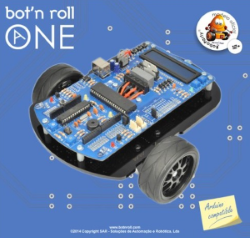

# Nino Pereira

* 
* 
* 
* 

Enthusiastic engineer with more than 10 years of industrial experience working in highly innovative international companies and organisations (DYSON, European Patent Office, SAR, BOSH, BIAL) developing complex and robust systems in the field of electronics, software and robotics. Driven by challenging projects and working with a motivated team in stimulating environments

## Technical Skills
* Algorithm development and mathematical modelling
* C/C++, Matlab, Python, Linux, ROS, Gazebo
* Motion Control, Trajectory tracking, Path Planning, Sensor fusion, Mapping, Localisation
* Computer Vision, Object detection/recognition, Machine Learning, Deep learning
* Portuguese (native), English (proficient), French (intermediate), Spanish (intermediate), German (A2)

## Highlighted Projects:

#### Dyson 360 Eye robot vacuum cleaner – using 360 degrees vision system for autonomous navigation
* Developed a new path deformation algorithm which combines both motion control and trajectory tracking functionalities taking into account the exact geometry of the robot and its kinematic constrains;

#### Golf ball Picker Robot – mobile robot for picking balls autonomously in golf driving ranges
* Developed new path planning algorithm for multiple non-mandatory targets, TWIN-RRT* which enables efficient asymptotically optimal trajectories to be generated in real time for up to 20 000 targets;

#### BOT’N ROLL ONE – mobile educational robot platform 
* Developed 4 generations of a mobile robotic platform from concept to product over 7 years which became a standard educational platform used in Roboparty® and Robocup™ international events

## Professional Experience
#### DYSON - Advanced Robotics Algorithms Engineer                             MALMESBURY, UK | October 2014 – Present
* Lead investigations in 5 areas: path planning, motion control, sensors, 3D simulation and mapping
* Work with the architecture team to identify functional requirements in 3 mobile robotic projects
* Collaborate with test teams to define testing strategies for new algorithms
* Guide and mentor fellow robotic engineers

#### EUROPEAN PATENT OFFICE - Patent Examiner            THE HAGUE, HOLLAND | October 2013 – October 2014
* Assessed over 20 patent applications in the field of computer devices and human interfaces
* Provided detailed reports on state-of-the-art technologies
 
#### UNIVERSITY OF GRONINGEN - Guest Researcher     GRONINGEN, HOLLAND | March 2013 – September 2013
* Developed algorithms, simulations and path planning methods such as TWIN-RRT* for mobile field robots
* 2 publications and PhD thesis: “Golf ball picker robot: path generation in unstructured environments towards multiple targets”

#### SAR – Project Developer                                          GUIMARÃES, PORTUGAL | September 2006 – February 2013
* Investigated and implemented sensor-guided mobile robotics solutions for 2 innovative products
* Developed software for computer vision, motion control and path-planning projects
* Submitted 3 patent applications: PT106417, WO2009022929 (A3), WO2007035122 (A1)
* Co-organized several Roboparty® events, workshops and exhibitions
* Managed and coordinated an European Project Application with a consortium of 3 companies

## Education
* UDACITY - Self-Driving Car Engineer Nanodegree                                                  October 2017
* MIT PORTUGAL - UNIVERSITY OF MINHO - Leaders for Technical Industries, Ph.D.                    January 2015
* UNIVERSITY OF MINHO - Industrial Electronics and Computer Engineer, Licenciate Degree           July  2006
* UNIVERSITY OF COIMBRA - Biochemistry, Licenciate Degree                                         December 1999
